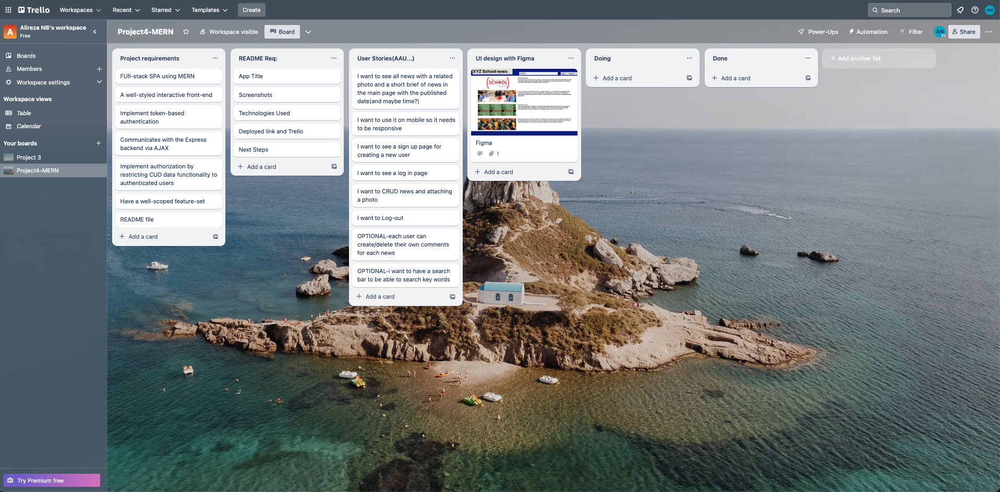
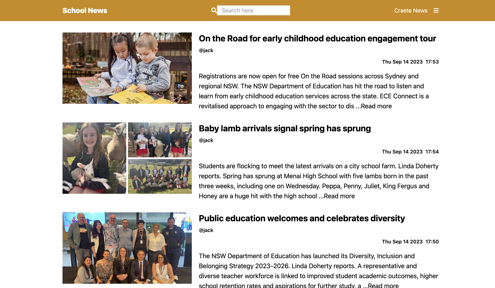

# General Assembly SEI Project 4 - School News - MERN Stack Application

## Overview
School news is my last project of the software engineering immersive bootcamp at GA Australia. We are asked to make a Full-Stack MERN application within a week. 

## Technologies used
* MongoDB
* Express.js
* React
* Node.js
* JavaScript
* Vita
* Tailwind CSS

### Planning
I started my project with setting up all requirements in Trello and definning user stories. As a user i want to...
* see all news with a related photo and a short brief of news in the main page with the published date and time.
* be able to use it on mobile browsers so it needs to be responsive.
* see a sign up page for creating a new user
* see a log in page for the users have been alredy registered
* CRUD news and attaching a photo
* be able to Log-out from my account

### Trello
Using **Trello** during any projects can be an excellent way to create a roadmap for the project so I used this powerful project managmnet tool in order to keep my project oragnised and well documented. 



# Back-end Overview:

### News Model

Defines the structure of the news articles. It includes fields like title, description, photo, username, and userId. This model is used to interact with the news data in the database.
```javaScript
const NewsSchema = new mongoose.Schema({

    title: {
        type: String,
        required: true,
        unique: true
    },

    description: {
        type: String,
        required: true,
        unique: true
    },

    photo: {
        type: String,
        required: false,

    },

    username: {
        type: String,
        required: true,
    },

    userId: {
        type: String,
        required: true,
    }

}
```


### User Model

Defines the structure of user accounts. It includes fields like username, email, and a hashed password. This model is used to manage user data and authentication.:
```javaScript
const NewsSchema = new mongoose.Schema({

    title: {
        type: String,
        required: true,
        unique: true
    },

    description: {
        type: String,
        required: true,
        unique: true
    },

    photo: {
        type: String,
        required: false,

    },

    username: {
        type: String,
        required: true,
    },

    userId: {
        type: String,
        required: true,
    }

}
```

### Routes
Routes are responsible for defining the HTTP endpoints and handling the incoming requests and responses. Each route file corresponds to a specific type of functionality or resource within your application, such as user authentication, user-related operations, news management. Here's what each of the route files does in general:

#### auth.js:

* Manages user authentication routes.
* Defines routes for user signup, login, logout, and user information refetching.
* Handles user registration, login, and token-based authentication.
#### user.js:

* Manages user-related routes.
* Defines routes for updating user details, deleting user accounts, and retrieving user information.
* Handles user profile-related operations.
#### news.js:

* Manages news-related routes.
* Defines routes for creating, reading, updating, and deleting news articles.
* Handles CRUD operations for news articles and image uploads.

## Database
MongoDB is used as the database system to store and manage data. MongoDB is a NoSQL database that is known for its flexibility and scalability, making it suitable for a wide range of applications.

# Front-end Overview

My project's front-end is a React-based web application that uses Tailwind CSS for styling, Axios for data fetching and API communication, and React Router for client-side routing. <br/> 
It's designed to be responsive and user-friendly, with various forms and components for different functionalities.



## Challenges
### Integration Complexity
The main challenge in creating a MERN stack application project is connecting the backend and frontend which involves creating a Node.js server with Express for the backend, using MongoDB as the database, and React for the frontend. 

### API Design
Designing a well-structured RESTful API with appropriate endpoints, managing request validation, and effectively handling error responses proved to be a demanding aspect of the project, requiring careful planning and attention to detail. 

## Wins
I learned how to build both the visible part of a website (called the frontend) and the behind-the-scenes logic that makes it work (known as the backend). This experience helped me become a more skilled full-stack developer, capable of creating complete web applications from start to finish. <br/>


## Enhancements and Upcoming Features
* Enhance the user interface and user experience of the news page
* Using comments for each news
* Sharing button 